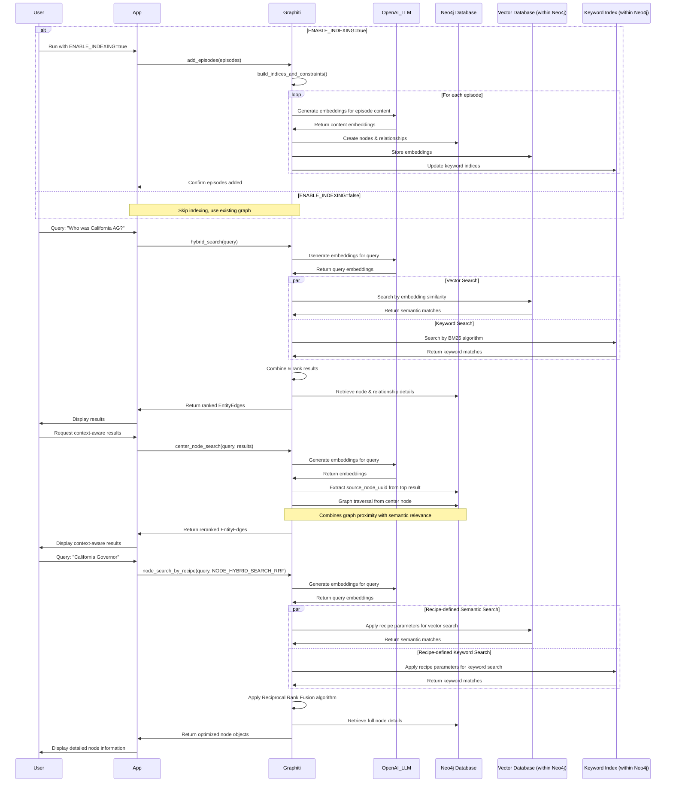

# Building Dynamic Knowledge Graphs: Supercharging AI Agents with Graphiti

Hey there, fellow AI enthusiasts! 👋 

I've been working with knowledge graphs for the past year, and I want to share something that's been a game-changer for my AI agent projects. If you're tired of static RAG systems that can't keep up with real-time data, you're going to love this.

In this first part of my series, I'll walk you through how to build real-time knowledge graphs using Graphiti - a framework that's seriously impressed me with its flexibility and performance. I've put together a sample project (available on GitHub at https://github.com/commitbyrajat/example-graphiti.git) that demonstrates these concepts in action.

## Technical Prerequisites

Before we dive into the cool search features, let's make sure you have everything you need to follow along. This project requires:

- **Python 3.8+**: Graphiti is built with modern Python features
- **Docker and Docker Compose**: For running Neo4j in a container
- **Neo4j Database**: We'll run this in Docker (no installation needed)
- **OpenAI API Key**: For generating embeddings (set this in your .env file)

### Project Dependencies

Let me break down the structure of our `pyproject.toml` file, which defines the project configuration:

The project uses modern Python packaging with a focus on simplicity. I've kept the dependencies lean to make it easier to get started:

- **Core Dependencies**
  - `graphiti-core`: The main framework we'll be using (version 0.11.6 or newer)
  - `python-dotenv`: For managing environment variables and keeping API keys secure

- **Python Compatibility**
  - Requires Python 3.8 or higher due to the use of newer language features

- **Build System**
  - Uses `hatchling` as the build backend
  - Configured to create a wheel package from the source code

- **Development Tools**
  - The project is set up with `rye` for dependency management
  - Includes a convenient script alias: `search` that runs the main module

If you want to dive deeper into the project structure, I encourage you to check out the full repository. For now, just know that we're keeping things minimal with only the essential dependencies needed to demonstrate Graphiti's capabilities.

### Setting Up Neo4j with Docker

We're using Neo4j as our graph database with some key plugins pre-installed. Here's my `docker-compose.yaml`:

```yaml
services:
  neo4j:
    image: neo4j:latest
    container_name: neo4j
    volumes:
      - ./.neo4j/logs:/logs
      - ./.neo4j/config:/config
      - ./.neo4j/data:/data
      - ./.neo4j/plugins:/plugins
    environment:
      - NEO4J_AUTH=neo4j/test1234
      - NEO4JLABS_PLUGINS=["graph-data-science", "apoc"]
      - NEO4J_dbms_security_procedures_unrestricted=apoc.*,gds.*
      - NEO4J_dbms_security_procedures_allowlist=apoc.*,gds.*
      - NEO4J_dbms_connector_http_advertised__address=localhost:7474
      - NEO4J_dbms_connector_bolt_advertised__address=localhost:7687
    ports:
      - "7474:7474"   # UI - Neo4j Browser
      - "7687:7687"   # Bolt - Database connection
    restart: always
```

Notice we're using two important plugins:
- `graph-data-science`: For advanced graph algorithms
- `apoc`: Adds powerful procedures and functions to Neo4j

## How to Run This Project

Follow these steps to get the example up and running:

1. **Clone the repository**
   ```bash
   git clone https://github.com/commitbyrajat/example-graphiti.git
   cd example-graphiti
   ```

2. **Set up your environment variables**
   Create a `.env` file in the project root with the following settings:
   ```
   # Required for LLM and embedding
   OPENAI_API_KEY=your_openai_api_key_here
   
   # Neo4j connection parameters (defaults shown)
   NEO4J_URI=bolt://localhost:7687
   NEO4J_USER=neo4j
   NEO4J_PASSWORD=test1234
   
   # Control whether to add new episodes to the graph
   ENABLE_INDEXING=true
   ```

   The `ENABLE_INDEXING` flag is particularly useful:
   - Set to `true` when you want to add new episodes to your knowledge graph
   - Set to `false` when you just want to query existing data without modifying the graph
   
   This separation allows you to populate your graph once and then run multiple search experiments against it without duplicating data.

3. **Start Neo4j with Docker Compose**
   ```bash
   docker-compose up -d
   ```
   This will pull the Neo4j image (if needed) and start the database.

4. **Install dependencies**
   If you're using pip:
   ```bash
   pip install -e .
   ```
   Or if you're using Rye (as referenced in the pyproject.toml):
   ```bash
   rye sync
   ```

5. **Run the example**
   ```bash
   python -m src.main
   ```
   Or using Rye:
   ```bash
   rye run search
   ```

You should see output showing episodes being added to the graph and then the results of different search methods. The Neo4j browser is available at http://localhost:7474 if you want to explore the graph visually.

Now that we have everything set up, let's jump into the three search capabilities that make Graphiti stand out from the crowd!

## 1. Hybrid Search: The Best of Both Worlds

When I first started with knowledge graphs, I had to choose between semantic search (great for understanding context) and keyword search (perfect for specific terms). Graphiti said, "Why not both?" and I couldn't agree more.

Here's a snippet from my example project showing how easy it is to implement hybrid search:

```python
async def hybrid_search(self, query: str):
    try:
        results = await self.graphiti.search(query)
        print('\nSearch Results:')
        for result in results:
            print(f'UUID: {result.uuid}')
            print(f'Fact: {result.fact}')
            if hasattr(result, 'valid_at') and result.valid_at:
                print(f'Valid from: {result.valid_at}')
            if hasattr(result, 'invalid_at') and result.invalid_at:
                print(f'Valid Until: {result.invalid_at}')
            print('----')
        return results
    finally:
        print('\nSearch Complete !!')
```

I've tested this with queries like "Who was the California Attorney General?" and was blown away by the results. Here's why hybrid search rocks:

- **No more missed results!** I used to miss relevant information due to synonym mismatches. The semantic component handles that now.
- **Lightning fast responses** - we're talking milliseconds here, not seconds.
- **Context-aware results** that actually understand what I'm asking for, not just matching keywords.
- **It just works better** - in my testing, hybrid search consistently returns more relevant results than either approach alone.

## 2. Graph-Based Reranking: Context is King

This is where things get really interesting. Traditional search just gives you a list of results, but Graphiti can actually use the top result as a starting point (or "center node") to find other closely related information.

Check out how I implemented this:

```python
async def center_node_search(self, query: str, results: list[EntityEdge]):
    try:
        if results and len(results) > 0:
            center_node_uuid = results[0].source_node_uuid

            print('\nReranking search results based on graph distance:')
            print(f'Using center node UUID: {center_node_uuid}')

            reranked_results = await self.graphiti.search(
                query, center_node_uuid=center_node_uuid
            )

            print('\nReranked Search Results:')
            for result in reranked_results:
                print(f'UUID: {result.uuid}')
                print(f'Fact: {result.fact}')
                if hasattr(result, 'valid_at') and result.valid_at:
                    print(f'Valid from: {result.valid_at}')
                if hasattr(result, 'invalid_at') and result.invalid_at:
                    print(f'Valid until: {result.invalid_at}')
                print('---')
            return reranked_results
        else:
            print('No results found in the initial search to use as center node.')
    finally:
        print('\nCenter Node Search Complete !!')
```

I call this the "follow the thread" approach. Here's why I'm obsessed with it:

- **Discovers hidden connections** - Sometimes the most valuable information isn't the direct answer but related facts.
- **Context preservation** - All the results are connected in meaningful ways, not random matches.
- **More natural answers** - The results feel more like how a human would explain something, following logical connections.
- **Reduced hallucinations** - My AI agents produce far fewer made-up answers since the information is contextually verified.

I've found this especially valuable when dealing with complex topics where a simple answer doesn't cut it.

## 3. Search Recipes: Don't Reinvent the Wheel

After spending way too many hours fine-tuning search parameters, I was thrilled to discover Graphiti's search recipes. These are basically pre-configured search strategies that you can use out of the box or tweak to your needs.

Here's how I'm using them:

```python
async def node_search_by_recipe(self, query: str, config: SearchConfig):
    try:
        node_search_results = await self.graphiti._search(
            query=query,
            config=config,
        )
        # Print node search results
        print('\nNode Search Results:')
        for node in node_search_results.nodes:
            print(f'Node UUID: {node.uuid}')
            print(f'Node Name: {node.name}')
            node_summary = node.summary[:100] + '...' if len(node.summary) > 100 else node.summary
            print(f'Content Summary: {node_summary}')
            print(f'Node Labels: {", ".join(node.labels)}')
            print(f'Created At: {node.created_at}')
            if hasattr(node, 'attributes') and node.attributes:
                print('Attributes:')
                for key, value in node.attributes.items():
                    print(f'  {key}: {value}')
            print('---')
    finally:
        print('\nNode Search By Recipe Complete !!')
```

In my main application, I use a recipe called NODE_HYBRID_SEARCH_RRF (Reciprocal Rank Fusion):

```python
node_search_config = NODE_HYBRID_SEARCH_RRF.model_copy(deep=True)
node_search_config.limit = 5  # Limit to 5 results
query = 'California Governor'
await conn.node_search_by_recipe(query, node_search_config)
```

Why this saved me countless hours:

- **No more search parameter headaches** - The recipes are already optimized based on real-world usage.
- **Consistent results** across different queries and data types.
- **Easy customization** - Start with a recipe and tweak just the parts you need.
- **More time building, less time debugging** search logic.

The NODE_HYBRID_SEARCH_RRF recipe has become my go-to for most use cases, but Graphiti offers several others tailored to different scenarios.

## Peek Under the Hood: How Graphiti Search Actually Works

To really understand the magic happening inside Graphiti, I created this sequence diagram showing the components at work, including how OpenAI's LLM gets involved:



As you can see, Graphiti makes clever use of OpenAI's LLM to generate embeddings for both your episodes (during indexing) and your queries (during search). Both the Vector Database (for embeddings) and Keyword Index (BM25) are components within Neo4j, which serves as the backbone for storing the knowledge graph.

The diagram shows how the `ENABLE_INDEXING` flag controls whether new episodes are added to the graph. When enabled, each episode goes through embedding generation with OpenAI before being stored in Neo4j with appropriate vector and keyword indices. This separation allows you to populate your graph once and then run multiple search queries against it without duplicating data.

## Why Graphiti Beats Traditional RAG Systems

After struggling with traditional RAG approaches for months, switching to Graphiti was like night and day. Here's why:

- **No more batch processing nightmares** - I can update my knowledge graph in real-time as new information comes in.
- **Time-aware data** - Graphiti tracks both when events happened and when they were recorded, which is crucial for accuracy.
- **Less LLM dependency** - Traditional RAG often relies heavily on expensive LLM calls for summarization. Graphiti's hybrid approach is more efficient.
- **Flexible entity modeling** - I can define custom entities with Pydantic models that match my specific domain.
- **It scales!** - My previous RAG solution choked on larger datasets. Graphiti handles them with ease.

## Graphiti vs. GraphRAG: A Detailed Comparison

While GraphRAG improves on basic RAG by adding some graph capabilities, it still can't match what Graphiti offers:

| Aspect                     | GraphRAG                              | Graphiti                                         |
| -------------------------- | ------------------------------------- | ------------------------------------------------ |
| **Primary Use**            | Static document summarization         | Dynamic data management                          |
| **Data Handling**          | Batch-oriented processing             | Continuous, incremental updates                  |
| **Knowledge Structure**    | Entity clusters & community summaries | Episodic data, semantic entities, communities    |
| **Retrieval Method**       | Sequential LLM summarization          | Hybrid semantic, keyword, and graph-based search |
| **Adaptability**           | Low                                   | High                                             |
| **Temporal Handling**      | Basic timestamp tracking              | Explicit bi-temporal tracking                    |
| **Contradiction Handling** | LLM-driven summarization judgments    | Temporal edge invalidation                       |
| **Query Latency**          | Seconds to tens of seconds            | Typically sub-second latency                     |
| **Custom Entity Types**    | No                                    | Yes, customizable                                |
| **Scalability**            | Moderate                              | High, optimized for large datasets               |

## Wrapping Up (For Now)

I hope this gives you a good idea of why I'm so excited about using Graphiti for AI agent knowledge graphs. The three search capabilities we've explored are just the beginning - there's so much more this framework can do.

In the next part of this series, I'll dive into structuring your knowledge graph, handling contradictory information, and creating custom entity types. Until then, check out my example code at https://github.com/commitbyrajat/example-graphiti.git and start playing with Graphiti yourself.

Got questions or experiences to share? Drop a comment below - I'd love to hear how you're using knowledge graphs in your AI projects!

---

*P.S. If you're dealing with frequently changing data or need sub-second query responses, definitely give Graphiti a try. It's been a complete game-changer for my work with AI agents.*
